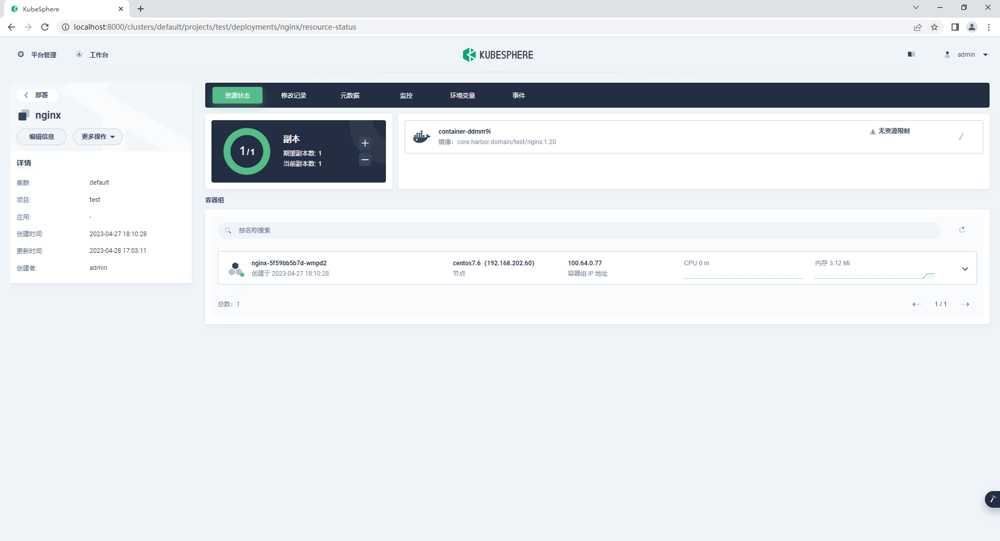
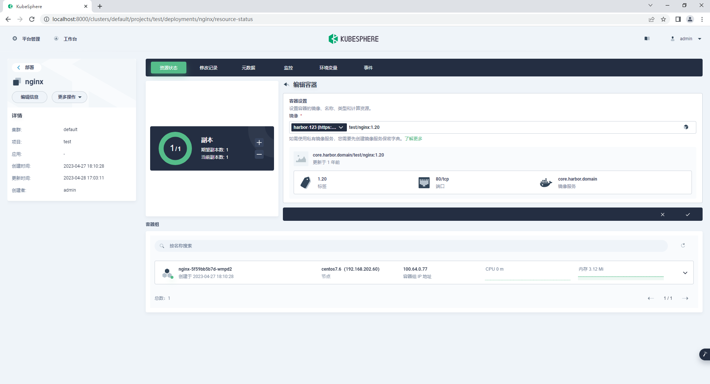
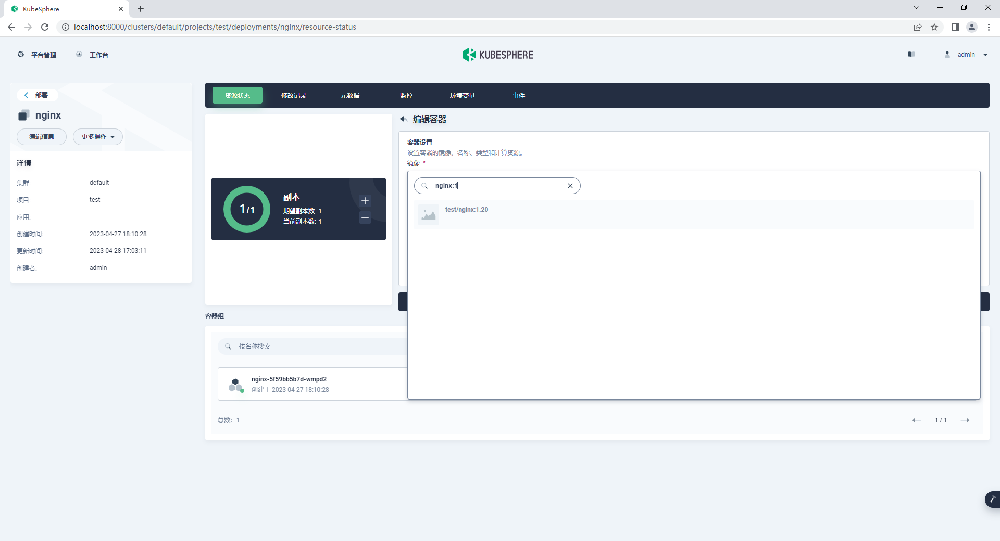
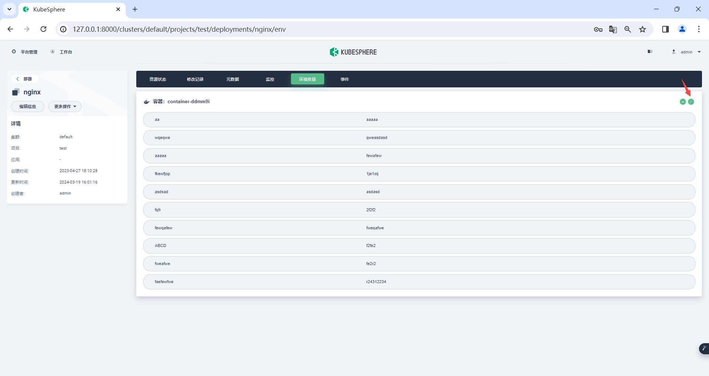
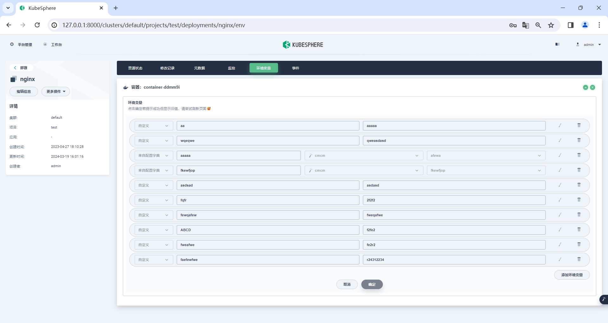
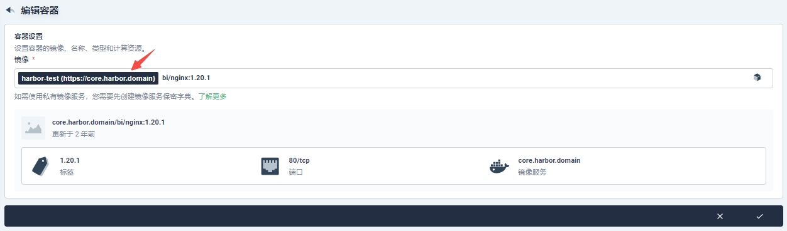

# KubeSphere Console yhwj
## 使用
> docker pull lkarrie/ks-console-yhwj:3.3.1.9  

为了更好的支持私库（harbor）基于官方3.3.1版本增加了一些功能

1. 增加工作负载快速更换镜像的功能
2. 快速更换镜像的部分移除了docker hub image 搜索支持
3. 自动搜索harbor镜像包括tags（最大数5）
4. 忽略证书错误自动重试
5. 默认harbor仓库名称由3个字符调整为2个
6. 增加快速编辑环境变量的功能

## 功能展示








## Todo

1. 异步搜索harbor镜像

## 已知问题

1. 当有一个namespace有多个harbor镜像密钥，首次只能展示一个
2. 对关闭或弃用chartmuseum的harbor环境，自动搜索最新harbor镜像功能将出现异常
3. 快速编辑环境变量完成后，实际更新成功，但是页面数据更新存在延迟

## 使用注意

快速替换镜像功能中，展示匹配harbor密钥和仓库的部分暂不支持自动补全功能，直接输入镜像名称时需要补全对应的harbor私库地址

例如：
core.harbor.domain/bi/nginx:1.20.1 升级镜像版本时需要输入 core.harbor.domain/bi/nginx:1.20.2 而不是 bi/nginx:1.20.2 



## 本地开发
开发相关基础环境设置如下

### 基础
```markdown
node -v
v14.16.1
```

### 配置调整
本地调试修改 server/config.yaml (打包时需要恢复注释)
```yaml
  apiServer:
    clientID: kubesphere
    clientSecret: kubesphere
    #url: http://ks-apiserver
    #wsUrl: ws://ks-apiserver
    url: http://192.168.202.60:30881
    wsUrl: ws://192.168.202.60:30881
```
### 启动开发环境

```bash
npm run dev:client

npm run dev:server
```

### 构建镜像
> docker build -f build/Dockerfile -t lkarrie/ks-console-yhwj:3.3.1.9 .

### 设置DEV K8S环境
```bash
kubectl -n kubesphere-system patch svc ks-apiserver -p '{"spec":{"type":"NodePort","ports":[{"port":80,"protocal":"TCP","targetPort":9090,"nodePort":30881}]}}'
```
### 默认信息

访问地址

http://192.168.202.60:30880/login

用户 / 密码 

admin/P@88w0rd

---

## Usage
> docker pull lkarrie/ks-console-yhwj:3.3.1.8  

Added some features based on official version 3.3.1 to support private libraries (Harbor)
1. The ability to quickly replace Harbor images for workloads
2. Added section removed Docker Hub Image search support
3. Automatically search for Harbor images including tags (maximum of 5)
4. Ignore certificate errors and automatically retry
5. Adjust the default Harbor repository name from 3 characters to 2
6. Add the function of quickly editing environment variables

## Todo
1. Asyn search for Harbor images

## Known issues
1. When a namespace with multiple Harbor image keys, only one can be displayed at the first time
2. The automatic search for the latest harbor image function cant used in harbor environments that disable or without harbor chartmuseum
3. After quickly editing the environment variables, update is successful, but there is a delay in updating the page data

# KubeSphere Console

[](https://gitpod.io/#https://github.com/kubesphere/console)

[](https://www.gnu.org/licenses/agpl-3.0)

KubeSphere console is the web interface for [KubeSphere](https://github.com/kubesphere/kubesphere).


## Getting Started

Console should be always used with KubeSphere, you can either use [Kubekey](https://github.com/kubesphere/kubekey) or [ks-installer](https://github.com/kubesphere/ks-installer) to create a KubeSphere cluster.  
The following will show you how to build console from source code.


### Prerequisite
#### Node.js
Console is written using Javascript. If you don't have a Node.js development environment, please [set it up](https://nodejs.org/en/download/). The minimum version required is 12.18.

#### Yarn
We use [Yarn](https://yarnpkg.com/) to do package management. If you don't have yarn, use the following to install:
```
npm install -g yarn@1.22.4
```
The minimum version required is 1.22.4, but you can use a newer version.

#### [Optional]Docker
This is optional. If you just want to test and build on your local environment, there is no need to install docker. Otherwise, you need to install it.
[Install on Mac](https://docs.docker.com/desktop/mac/install/)
[Install on Windows](https://docs.docker.com/desktop/windows/install/)
[Install on Ubuntu](https://docs.docker.com/engine/install/ubuntu/)

#### [Optional]Make
This is optional too, we use `make` to reduce hand work, but it's totally ok without it.

## How to build

Clone the repository, and run `yarn && yarn build`
```sh
git clone https://github.com/kubesphere/console.git
cd console/
yarn && yarn build
npm run serve
```
> If you have trouble downloading the dependencies, try the following
>
> `yarn config set registry https://registry.npmmirror.com`


After `npm run serve`, you should see the output like the following

```
> kubesphere-console@master serve
> NODE_ENV=production node server/server.js

Dashboard app running at port 8000
```
Now, console is up and running. But since there is no backed KubeSphere cluster, you shouldn't be able to login.

## How to debug
A KubeSphere cluster is required to start debugging. You can refer to [Installation](https://github.com/kubesphere/kubesphere#installation) to create a KubeSphere cluster.

Once the cluster is up, you replace the address of `ks-apiserver` in `server/config.yaml` with your real address. You can refer to [access KubeSphere apiserver](docs/access-backend.md) to expose your cluster `ks-apiserver`.
```
  # backend service gateway server
  apiServer:
    clientID: kubesphere
    clientSecret: kubesphere
    url: http://ks-apiserver
    wsUrl: ws://ks-apiserver
```

## How to build container image

Just run the following command with your real `REPO` address.
```
REPO=yourawesomerepo make container
```

## How to submit a PR

Follow [Development Workflow](/docs/development-workflow.md) to commit your codes.

## Features Map:


## Support, Discussion, and Community

If you need any help with KubeSphere, please join us at [Slack Channel](https://join.slack.com/t/kubesphere/shared_invite/zt-1ilxbsp39-t4ES4xn5OI0eF5hvOoAhEw).

Please submit any KubeSphere Console bugs, issues, and feature requests to [KubeSphere Console GitHub Issue](https://github.com/kubesphere/console/issues).

## Contributing to the project

Welcome to contribute to KubeSphere Console, see [Contributing Guide](CONTRIBUTING.md).

The KubeSphere localization project has been launched on Crowdin. You can help localize the KubeSphere web console by referring to the [localization guide](docs/join-the-kubesphere-localization-project.md).
